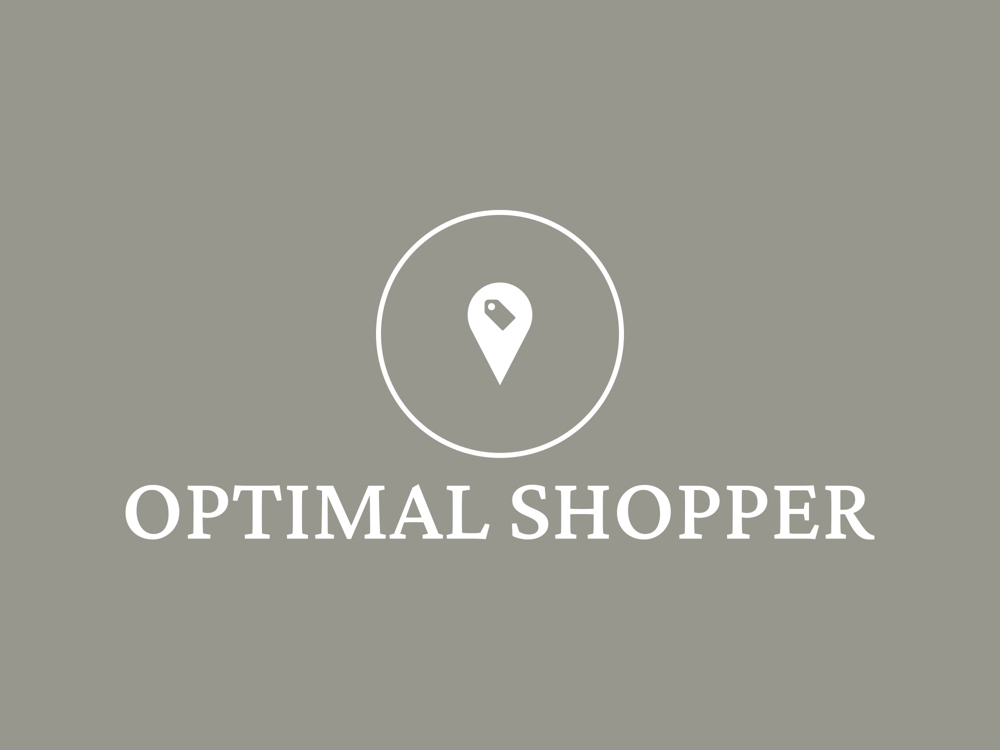
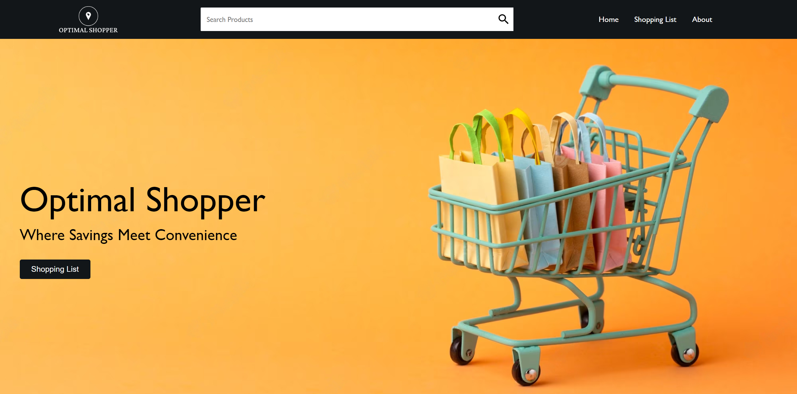
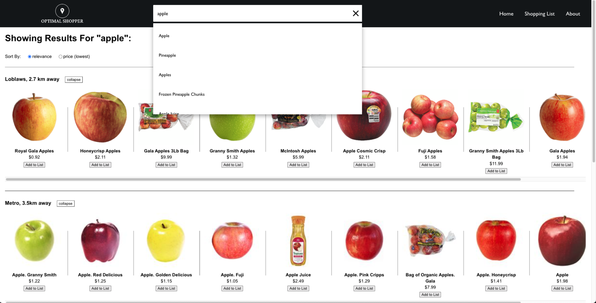
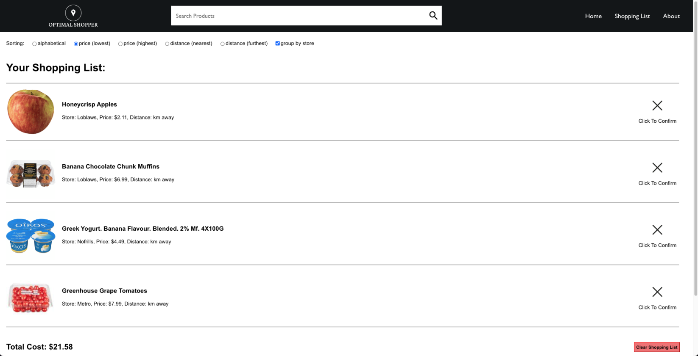

<h1 style = "text-align:center;">
Welcome to Optimal Shopper
</h1>
 
<div align="center">
    
</div>

</br>

## About the Project
As a group of incoming imcompetent freshman, we realized that we would inevitably be faced with the daunting task of shopping for ourselves. To assist ourselves in this process, we created a web app that enables the user to search for a product and receive results of local grocery stores with the ability to filter by price.Users then have the ability to add products to a shopping list that displays the total cost. There is also the ability to group by store on the shopping list page if desired. 

### Built With

* [![Node][Node.js]][Node-url]
* [![React][React.js]][React-url]
* [![Express][Express.js]][Express-url]

[Node.js]: https://img.shields.io/badge/Node.js-43853D?style=for-the-badge&logo=node.js&logoColor=white
[Node-url]: https://nodejs.org/en/
[React.js]: https://img.shields.io/badge/React-20232A?style=for-the-badge&logo=react&logoColor=61DAFB
[React-url]: https://reactjs.org/
[Express.js]: https://img.shields.io/badge/Express.js-404D59?style=for-the-badge
[Express-url]: https://expressjs.com/

Node was used to run the backend, react for the frontend, and Express for communication between the frontend and backend.

### Installation

_Below is an example of how you can instruct your audience on installing and setting up your app. This template doesn't rely on any external dependencies or services._

1. Clone the repo
   ```sh
   git clone https://github.com/your_username_/Project-Name.git
   ```
2. Install NPM packages
   ```sh
   npm install
   ```
3. For the back-end, in cluster.js change line numbers 38, 77, and 130 to your own file directories in order to store the separate shop .csv files

### Usage
Main page:
<div align="center">
    
</div>
</br>
Search results after a search:
<div align="center">
    
</div>
</br>
Shopping list:
<div align="center">
    
</div>

## Contact

Benjamin Wang - benjaminwang4242@gmail.com

Vincent Sun - vincentjsun@gmail.com

Justin Li - justinli2013@gmail.com

Danny Zhang - dannyzhang235@gmail.com

Emma Gui - gui.emma1984@gmail.com

Project Link: [https://github.com/Dudemario/GroceryWebApp](https://github.com/Dudemario/GroceryWebApp)
